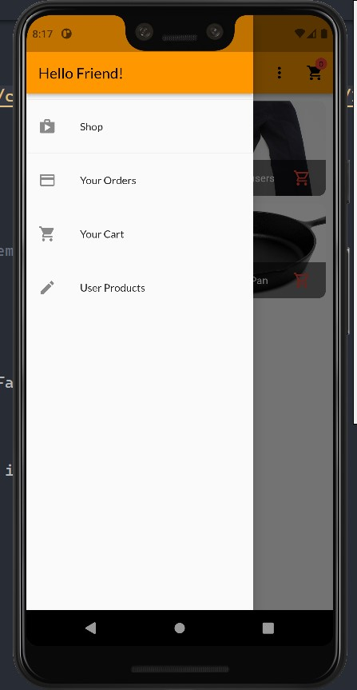
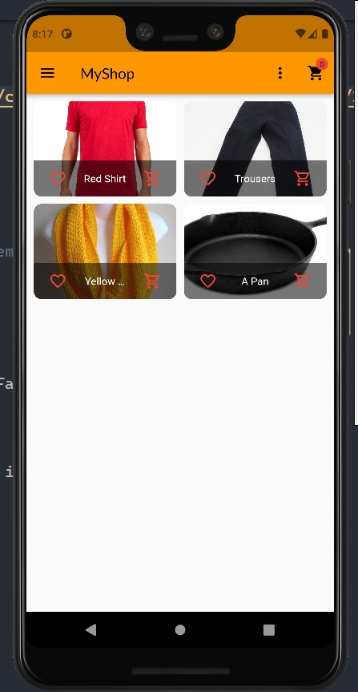
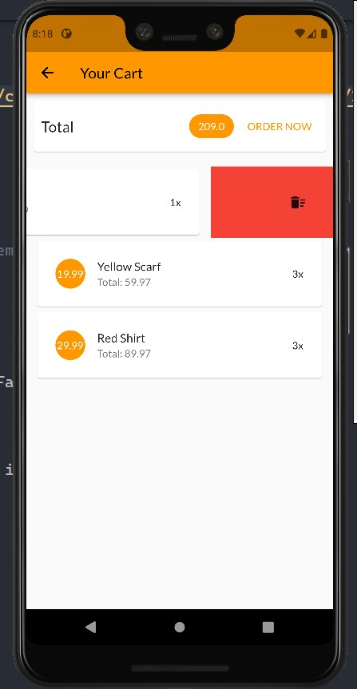
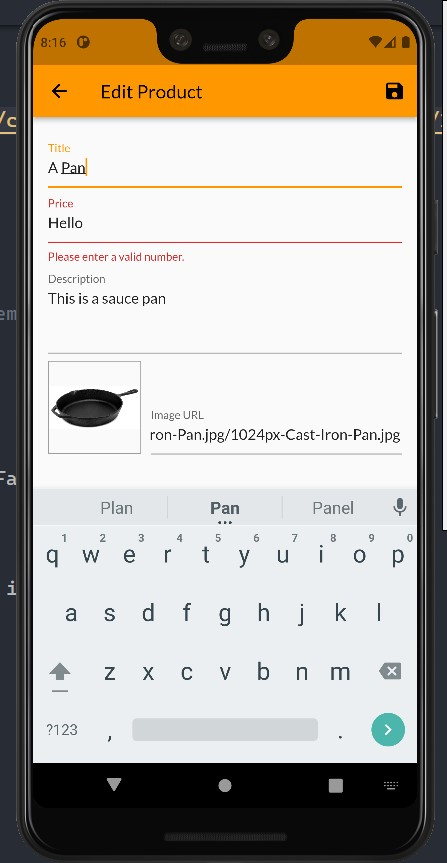
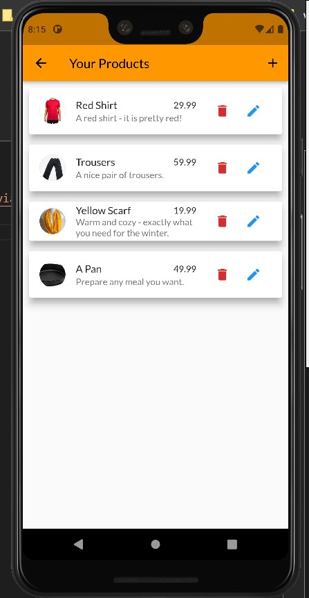

# A Shop Application For Mobile

This is a basic shop/grocery/items application with Rest API features , User Authentication where FireBase is used as a backend. 

## Environment Variables

To run this project, you will need to add the following environment variables to your .env file

- Flutter SDK
- A Device Emulator `Android Studio will be needed`
- run
`flutter upgrade` command incase to avoid an outdated SDK
- run 
`flutter run` command after chosing the virtual device of your choice 

## Features

- Login
- SignUp
- Logout
- Add Products To Cart
- Select Favorite items
- Save and Load prodcuts from database using http requests.
- Cross platform 
- Delete products from the cart by left swipe

## Packages Used:

- cupertino_icons: ^1.0.2
- provider: ^6.0.3
- dcdg: ^4.0.1
- intl: ^0.17.0
- http: ^0.13.4
- loading_animation_widget: ^1.2.0+2
- shared_preferences: ^2.0.15

`More Features Coming Soon`

## Screenshots

